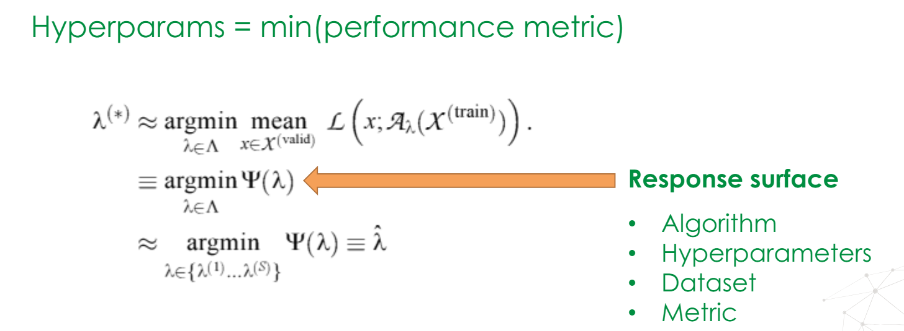
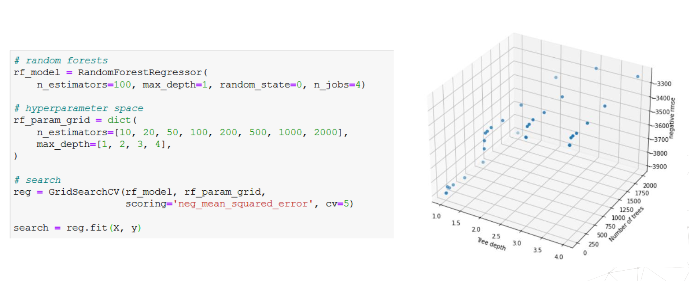

# Hyperparameter Tuning

- It's the process of finding best hyperparams for a given dataset that minimizes the **generalization error (not necessarily the loss).**

- The critical step is to choose **how many** diff. hyperparams combinations we are going to test.
  - As you increase the parameter combinations, higher the chances of getting a better model, at the cost of higher computational cost.

- Different hyperparameter optimization strategies:
  - Manual Search
  - Grid Search
  - Random Search
  - Bayesian Optimization
  - Others

- Hyperparameter Tuning: Search
  - Hyperparameter Space: the range of values which we're going to use for diff. parameters
  - A method for sampling candidate hyperparameters from the space
  - A cross-validation scheme
  - A performance metric to minimize (or maximize)

- **Hyperparameter Response Surface**
  - Find the hyperparameters that minimize (or maximize) a performance metric 
  - $$Hyperparams = min(\text{performance metric})$$

- **Low effective dimension**
  - $\Psi(\lambda)$, i.e., response surface, are more sensitive to changes in some dimensions and not all.
  - Most parameters do not matter much

