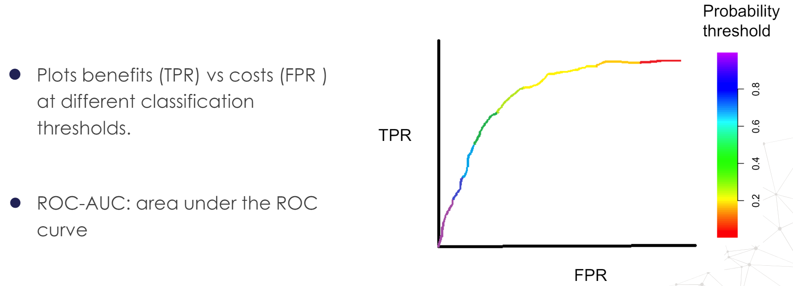
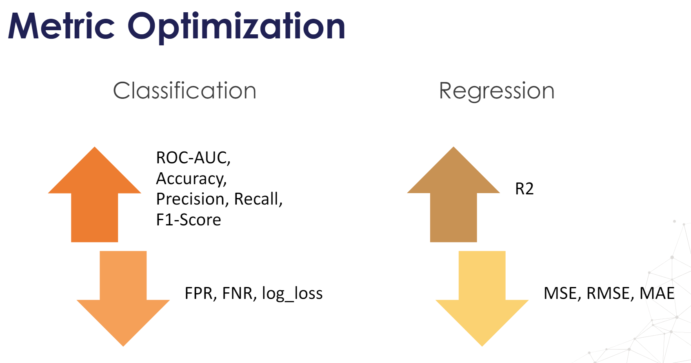

# Performance Metrics

## Classification Metrics

### Dependent of the Probability Threshold

- $Accuracy = \frac{\text{No. of correct predicitons}}{\text{Total no. of predicitons}}$

-  **Confusion Matrix**

|                | Predicted Negative | Predicted Positive |
|----------------|--------------------|--------------------|
| Actual Negative | TN                 | FP                 |
| Actual Positive | FN                 | TP                 |

- True Positive Rate(Recall/Sensitivity/TPR)
  - $Recall = \frac{TP}{TP + FN}$
  - Answers how well model can classify positive class from all the actual poitive class datapoints.

- Positive Predictive Value (Precision)
  - $Precision = \frac{TP}{TP + FP}$
  - Answers how model can predict positive class from all the classifed poitive class datapoints.

- F1 Score - weighted harmonic mean of precision and recall.
  - $\text{F1-Score} = \frac{2 \times Precision \times Recall}{Precision + Recall}$
  
- False Positive Rate, $FPR = \frac{FP}{FP + TN}$

- False Negative Rate, $FNR = \frac{FN}{TP + FN}$

### Independent of the Probability Threshold

- ROC Curve (Receiving Operating Characteristic Curve)
    - For each probaility threshold, it is the plot b/w obseravtions that are correctly classified(TPR) and obs. that are incorrectly classified(FPR).
    
    - ROC-AUC: area under the ROC curve.
    - ROC AUC score shows how well the classifier distinguishes positive and negative classes. - It can take values from 0 to 1.
    - A higher ROC AUC indicates better performance. A perfect model would have an AUC of 1, while a random model would have an AUC of 0.5.

 

* **

- Loss Function: $L_{log}(y,p) = -(y\log{p} + (1-y)\log{1-p})$

* **

## Regression Metrics

- $MSE(y, \hat{y}) = \frac{1}{n_{samples}}\sum_{i=0}^{n_{samples} - 1}(y_i - \hat{y}_i)^2$
  
- $RMSE = \sqrt{MSE}$
  
- $MAE(y, \hat{y}) = \frac{1}{n_{samples}}\sum_{i=0}^{n_{samples} - 1}|y_i - \hat{y}_i|$

- $R^2(y, \hat{y}) = 1 - \frac{\text{Sum of squares of the residual errors}}{\text{Total sum of the errors(Variance)}} = 1 - \frac{\sum_{i=1}^{n}(y_i - \hat{y}_i)^2}{\sum_{i=}^{n}(y_i - \bar{y}_i)^2}$ 

    - Gives us a measure of how of the total variance that exists in our data is explained by our model.
    
    - An R-Squared value of 0 means that the model explains or predicts 0% of the relationship between the dependent and independent variables.

    - A value of 1 indicates that the model predicts 100% of the relationship, and a value of 0.5 indicates that the model predicts 50%, and so on. 

* **

