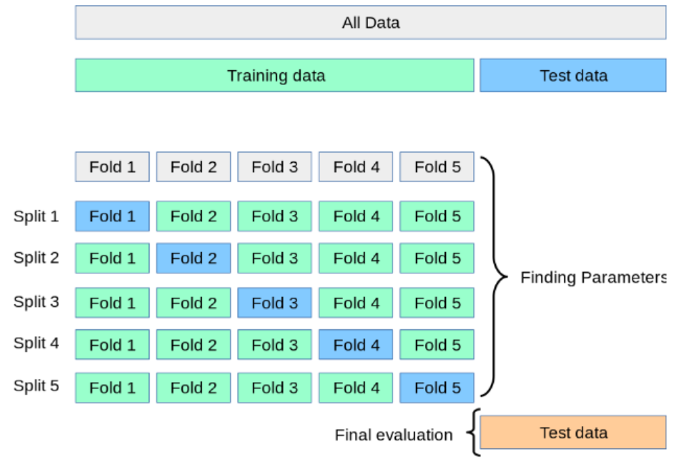
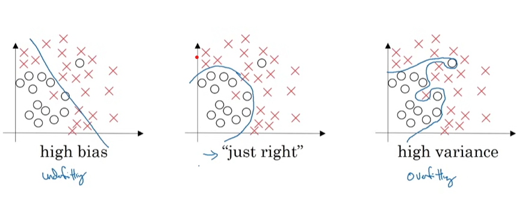
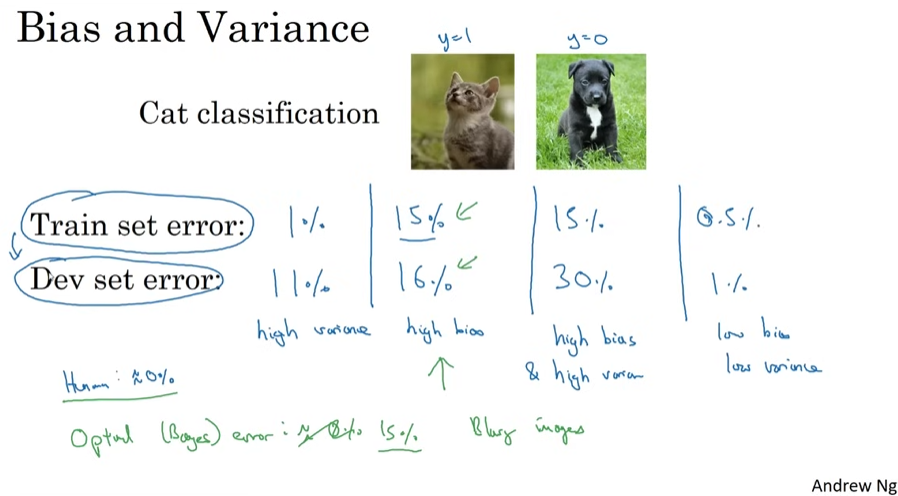

# Cross-Validation

## Generalization & Over-fitting

- Generalization is the ability of an algorithm to be effective across various inputs.

- The performance of the machine learning model is constant across different datasets **(with the same distribution of the training data)**.

- When a model performs well on the train set, but not on new/naïve data, the model over-fits to the training data

## Tuning Hyperparams

- When using Train/Test Set, for evaluating model peformance in different hyperparameter space, there is a risk of over fitting.

- We select the best model based on performance over test set.

- This way there is chance that knowledge of the test-set can "leak" into the model, thus effecting generalization.

- Another way is to use train-val-test set; but for this the data should be sufficient!

## Cross-Validation

- Train set divided into k folds
- Model trained in $k-1$ fold
- Model tested in the $k^{th}$ fold
- Repeat k times
- Final performance metric is the average
- At last we can determine an error for the metric, $\text{metric} \pm \text{error}$

* **

- Types of CV:
    - K-Fold
    - Leave One Out(LOOCV)
    - Leave P Out(LPOCV)
    - Repeated K-Fold
    - Stratified K-Fold
    - Group Cross-Validation
    - Nested Cross-Validation

## Bias & Variance

- [Andrew Ng Bias/Variance Video](https://youtu.be/SjQyLhQIXSM?si=u6p9LifY80dFYc7l)
- **Bias:** --> Underfitting
- **Variance:** ---> Overfitting 

- **High Variance ---->** Train Set Error: Low, Test Set Error: High
- **High Bias ---->** Train Set Error, Test Set Error: Both aprrox. same, high; not able to even properly fit training set.
- **High Bias & Variance ---->** High Training Error and even higher Test Error
- **Low Bias & Variance---->** Low Training Error and Low Test Error

  - Human Error ~ 0%dd
  - Optimal(Bayes) Error ~ 0% --> Search about it!

## Different CV Methods

### K-Fold Cross-Validation

- Divide Train set into k folds (of equal size)
- Train model in k-1 fold
- Test model in kth fold
- Repeat k times  train k models
- K performance values
- Final performance metric: mean ± std_error

> [Standard Error & Standard Deviation](https://careerfoundry.com/en/blog/data-analytics/standard-error-vs-standard-deviation/)

* **

- Typically K = 5/10
- Higher K: 
  - Bigger train sets
  - less model bias
  - more variance
- - No overlap of test sets in the different folds

### Leave One Out Cross-Val (LOOCV)

- K = n, where n is the number of observations
- Divide Train set into n folds
- Train model in n-1 fold
- Test model in nth observation
- Repeat n times ---> train n models
- n performance values
- Final performance metric: $\text{mean} \pm \text{std}$

* **

- Computationally expensive
- Models are almost identical as they are trained on practically the same training dataset ----> high variance
- No overlap of test sets in the different folds
- Some metrics can’t be estimated, i.e., ROC-AUC, precision and recall.

### Leave P Out CV (LPOCV)

- Leaves out all possible subsets of p observations
- For n observations, this produces $\binom{n}{p}$ train-test pairs
- There is overlap the different test sets
- We have bigger validation sets ---> better measure of performance (than LOOCV)
- Very computationally expensive

### Repeated K-Fold CV

- Repeats K-Fold Cross-Validation, n times, each times making different data split
- The values of the training set are shuffled before making the split into the K fold
- Repeat n times: Shuffle data ---> K-Fold CV
- $K \times n$ performance metrics
- There could be overlap between the tests sets in different repeats

### Stratified K-Fold CV

- **Only for classification**
- Procedure identical to K-fold Cross-Validation,
- Ensures that each fold has a similar proportion of observations of each class
- **Useful with (very) imbalanced datasets**
- K performance metrics
- No overlap of test sets

## Use of CV

- Estimate the generalization error of a given model
- Select best performing model from a group of models
    - Different algorithms
    - Different feature subsets
- Select hyperparameters

## To Consider

- **Generally use K-fold cross-validation with K equals 5 or 10**

- **Use Stratified K-fold if target class is imbalanced**

- **If K is too small, the error estimate is pessimistically biased because of the difference in training-set size between the original dataset and the cross-validation datasets.**

- **Leave-one-out cross-validation works well for estimating continuous error functions (e.g., mean squared error), but it may perform poorly for discontinuous error functions, (e.g., number of misclassified cases, precision and recall).**

## Check `./assets/` folder for other CV Schemas

- Grouped Cross Validation
- Nested Cross Validation
