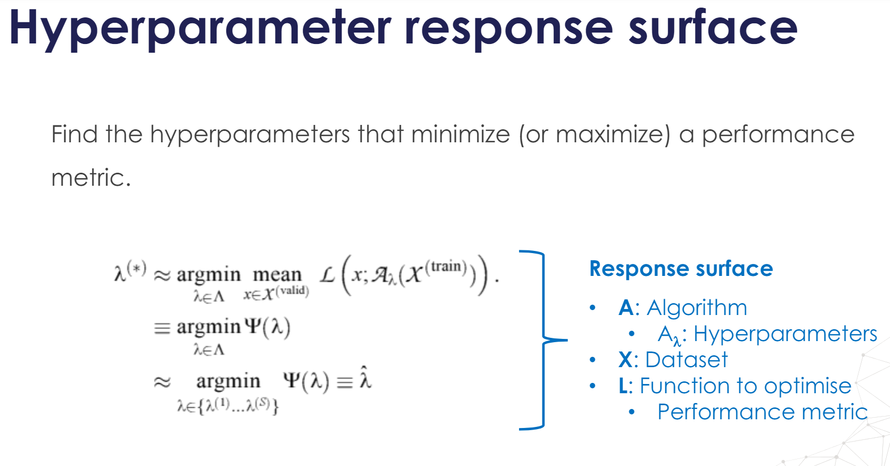
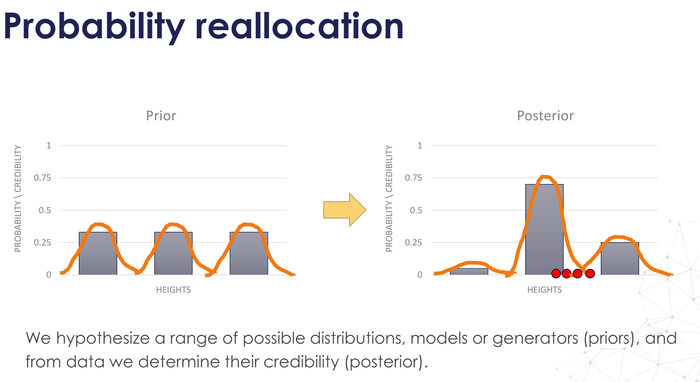
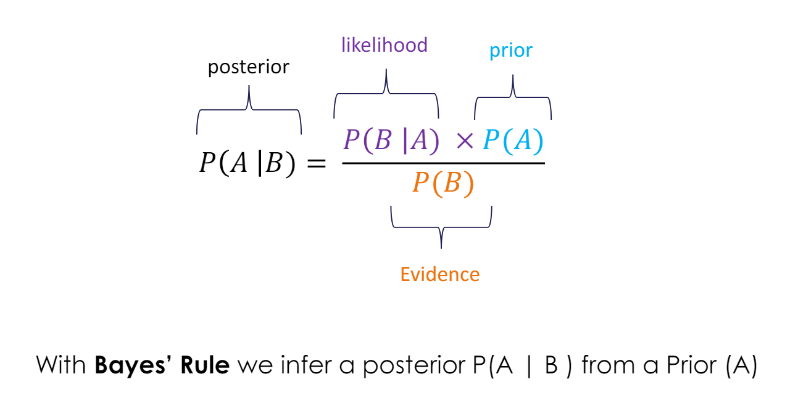
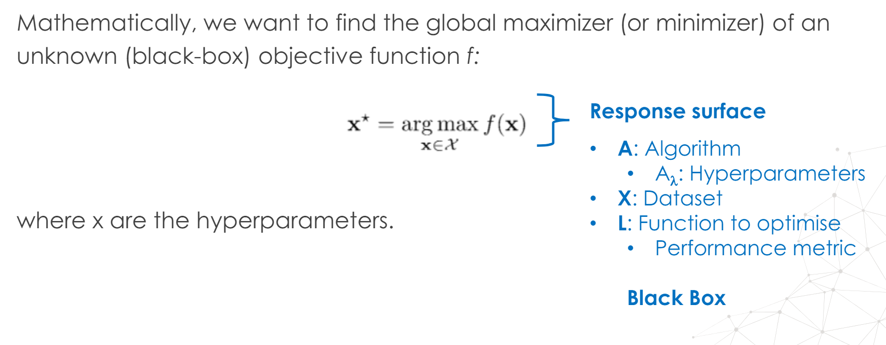
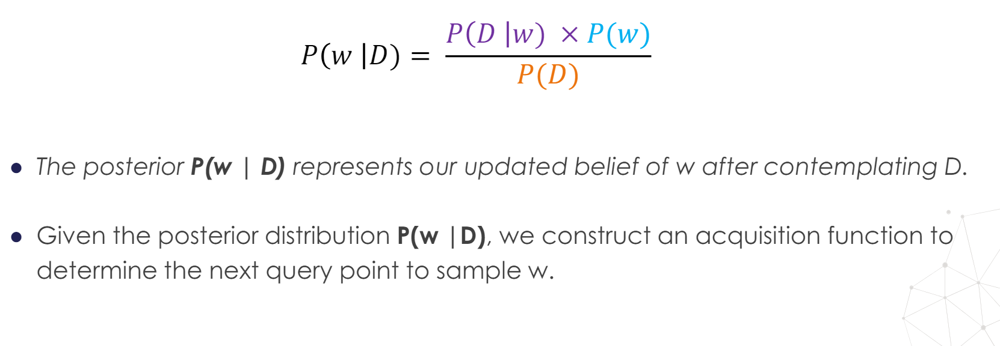

# Hyperparameter Tuning: Challenges

- We can't define a formula to find the hyperparameters $\rightarrow$ **black box function**
- The response surface is not differentiable $\rightarrow$ it does not have a gradient
- Try different combinations of hyperparameter and evaluate model performance

# Sequential Search

- Grid Search and Random Search generate all the candidate points up front and evaluate them in parallel.

- For complex models(like Neural Nets.), we cannot use above methods due to very high number of parameters.

- **Sequential search** techniques pick a few hyperparameter settings, evaluate their quality, then decide where to sample next.

    - Iterative and sequential process
    - Not parallelizable
    - Goal: make fewer evaluations, only of those most promising candidate hyperparameters

## Sequential Search Trade-off

- Sequential search techniques pick a few hyperparameter settings, evaluate their quality, then **decide where to sample next.**

- Trade-off:
  - Less ML model training time $\times$ time to estimate where to sample next

- **Sequential search makes sense when the evaluation procedure (training the model – performance) takes much longer than the process of evaluating where to sample next.**

# Bayesian Optimization

- Bayesian optimization is a sequential strategy for global optimization of black-box functions, which does not assume any functional forms.

- Bayesian optimization is usually employed to optimize expensive-to-evaluate functions.

- Mathematically, we want to find the global maximizer(or minimizer) of an unknown(black-box) objective function $f$: 

$$x^{*} = \underset{x \in \chi}{\mathrm{arg max}}\, f(x)$$ 

where x are hyperparameters.

- **The objective function $f$:**

    - $f$ is continuous
    - $f$ is difficult to evaluate $\rightarrow$ too much time or money
    - $f$ lacks known structure, like concavity or linearity $\rightarrow$ $f$ is black-box
    - $f$ has no derivative $\rightarrow$ we can't evaluate a gradient
    - $f$ can be evaluated at arbitrary points of x (the hyperparameters)
      - We can make point-wise observations of $f$

* **

$$x^{*} = \underset{x \in \chi}{\mathrm{arg max}}\, f(x)$$ 

**$f$ is unknown**

1. In Bayesian optimization we treat $f$ as a random function and place a **prior** over it. *(the prior is a function that captures the belief-distribution, behaviour of f)*

2. Then, we evaluate f at certain points

3. With the new data, the prior (f original belief) is updated to a new the **posterior distribution**

4. The posterior distribution is used to construct an **acquisition function** *to determine
the next query point.*

**Estimating the prior:**

- Gaussian Process
- Tree-parzen estimator
- Random Forests

**Acquisition Function:** that determines the next point to evaluate on.

- Expected Improvement (EI)
- Gaussian process upper confidence bound (UCB)

# Bayesian Inference - Intro

### Foundations

- Bayesian inference is the reallocation of credibility (i.e., probability) across possibilities.

- The possibilities across which the credibility (probability) is reallocated are usually the parameters (or hyperparameters) of a mathematical model.

- In Bayesian Statistics, the probability (credibility) expresses the degree of belief in an event.

- The degree of belief can be based on prior knowledge about the event, i.e., data from an experiment, or on personal beliefs about the event.

- These beliefs (probabilities) can be updated when we gather new information about the event.

- We use Bayes' rule to update the belief (probability).

* **

### Prior and Posterior Probability

- $\text{Joint Probability: } P(A, B)$, Joint Probability is symmetric: $P(B, A) = P(A, B)$ 
- $\text{Marginal Probability: }P(A) = \sum{P(A, B)}$
- $\text{Conditional Probability: }P(A|B) = \frac{P(A, B)}{P(B)} = \frac{\text{Joint Prob of A and B}}{\text{Prior Probability of B}}$

- **Prior probability** is the unconditional probability assigned to an event before any relevant information is taken into account.

- The **posterior probability of an event**, is the conditional probability that is assigned after taking into account the new evidence.

- Prior and posterior are mathematically related by Bayes' Rule

* **

### Bayes' Rule:

$P(B, A) = P(A, B)$ 

$P(B|A) = \frac{P(B, A)}{P(A)} \implies P(B, A) = P(B|A) \times P(A)$

**Bayes' Rule:** 

$$P(A|B) = \frac{P(A, B)}{P(B)} = \frac{P(B|A) \times P(A)}{P(B)} = \frac{P(B|A) \times P(A)}{\sum{(P(B|A) \times P(A))}}$$

- A and B are events, like breed and dysplasia.
- $P(A|B)$ is the posterior (conditional) probability of A taking place given the new evidence B.
- $P(B|A)$ is also a conditional probability, of B taking place given A.
- $P(A)$ and $P(B)$ are the marginal probability of A and B taking place independently.

**Bayes' rule gets us from the prior $P(A)$, to the posterior (conditional) distribution $P(A|B)$, when focusing on a specific value of B.**

$$\text{Posterior} \propto \text{Likelihood} \times \text{Prior}$$
$$P(A|B) \propto P(B|A) \times P(A)$$

* **

### Bayes' Rule Value:

- **Key application of Bayes' Rule when A is data and B is parameters.**

- **A model specifies $P(data|parameters)$ and the prior $P(parameters)$**

*We use Bayes’ Rule to convert that into what we are interested in:*

- **How strongly should we believe in the parameters given the data $\rightarrow$ the posterior $P(parameters|data)$**

# Hyperparameter Optimization

- Let $w$ be $f(x)$ (the response-surface) & $D$ be the avaialable data.
- $w$ is unknown, so we treat is as a random function and place a **prior** over it $\rightarrow$ $P(w)$
- $P(w)$ captures our beliefs about the possible values of $w$.
- **Given $D$ and the likelihood model $P(D|w)$, we can infer the posterior $P(w|D)$ using Bayes' rule.**

**$\rightarrow$  `./assets/05-SMBO.pdf` for more details**
